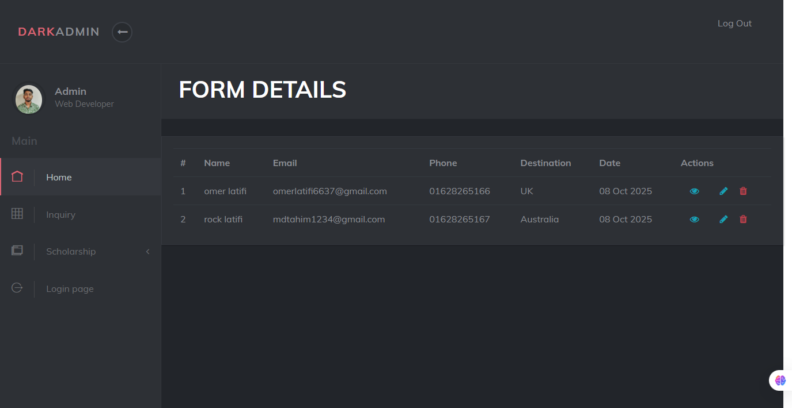
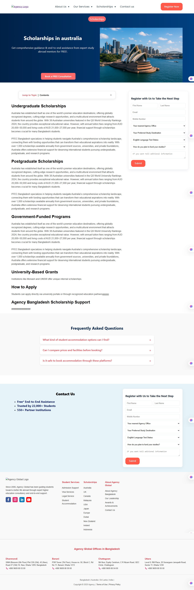

# Agency Website
A dynamic website for abroad student consultancy built with Laravel and Bootstrap. Most pages are static, except the admin panel for managing student forms and countries.

---

## 🔹 Features
- Static frontend pages: Home, About Us, Services, Contact  
- Admin panel (dynamic):  
  - Read student application forms  
  - Upload and manage country information  
- Responsive design for desktop and mobile  
- Clean and professional UI for agency consultancy  

---

## 🔹 Screenshots
Place screenshots in `agencyadmin/project_overview_agency` folder in your repo:

